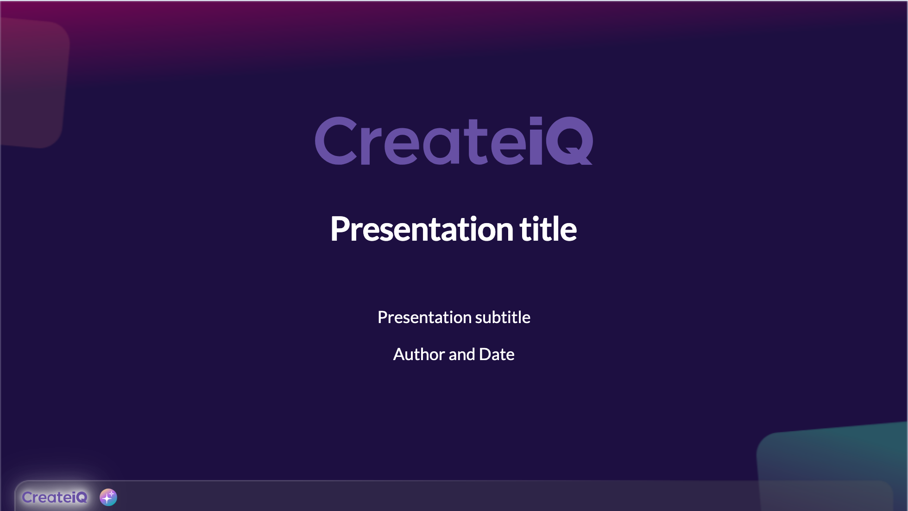
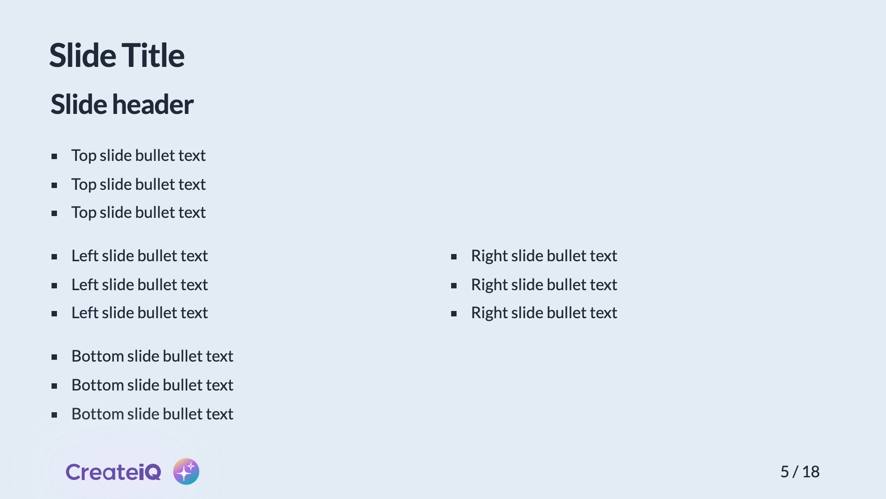

# @createiq/slidev-theme

[](https://www.npmjs.com/package/@createiq/slidev-theme)

A CreateiQ theme for [Slidev](https://github.com/slidevjs/slidev).

## Install

Add the following frontmatter to your `slides.md`. Start Slidev then it will prompt you to install the theme automatically.

<pre><code>---
theme: <b>"@createiq/slidev-theme"</b>
---</code></pre>

Note that the quoting is required so that the @ isn't interpreted incorrectly by the YAML parser.

Learn more about [how to use a theme](https://sli.dev/guide/theme-addon#use-theme).

## Layouts

This theme provides the following layouts:

### Title
Usage:
```
---
layout: cover
---

# Presentation title

Presentation subtitle

Author and Date

```


---

### Default
Usage:
```
---
layout: default # can be omitted
---
```


---

### Two columns with header
Usage:
```
---
layout: two-cols-header
---

# Slide Title

## Slide header

* Slide bullet text

::left::

* Slide bullet text

::right::

* Slide bullet text
```

