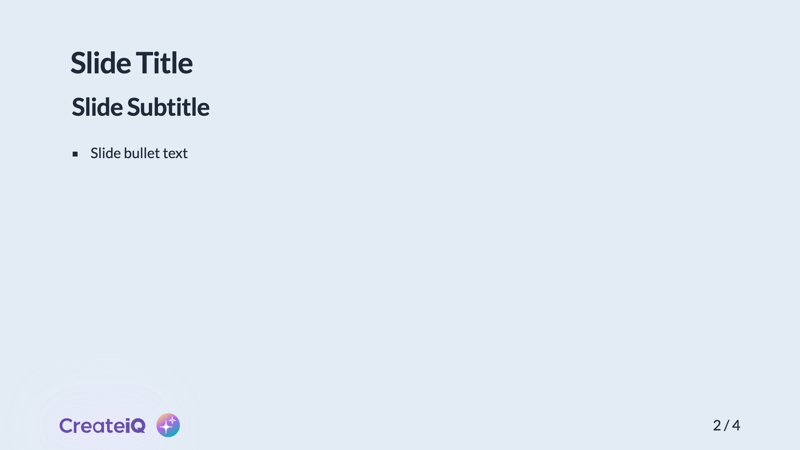
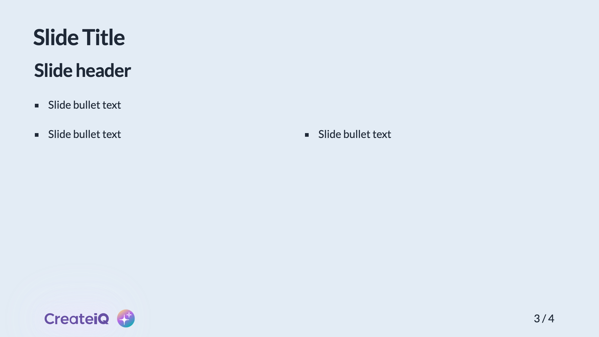

# @createiq/slidev-theme

[](https://www.npmjs.com/package/@createiq/slidev-theme)

A CreateiQ theme for [Slidev](https://github.com/slidevjs/slidev).

## Install

Add the following frontmatter to your `slides.md`. Start Slidev then it will prompt you to install the theme
automatically.

<pre><code>---
theme: <b>"@createiq/slidev-theme"</b>
---</code></pre>

Note that the quoting is required so that the @ isn't interpreted incorrectly by the YAML parser.

Learn more about [how to use a theme](https://sli.dev/guide/theme-addon#use-theme).

## Layouts

This theme provides the following layouts:

### Title

Usage:

```
---
layout: cover # or intro
---

# Presentation title

Presentation subtitle

Author and Date

```


---

### Default

Usage:

```
---
layout: default # can be omitted
color: light # light|dark, default is light
---
```

|            `color: light` (default) | `color: dark`                                 |
|------------------------------------:|:----------------------------------------------|
|  |  |

---

### Two columns with header

Usage:

```
---
layout: two-cols-header
color: light # light|dark, default is light
---

# Slide Title

## Slide header

* Top slide bullet text
* Top slide bullet text
* Top slide bullet text

::left::

* Left slide bullet text
* Left slide bullet text
* Left slide bullet text

::right::

* Right slide bullet text
* Right slide bullet text
* Right slide bullet text

::bottom::

* Bottom slide bullet text
* Bottom slide bullet text
* Bottom slide bullet text
```

|                            `color: light` (default) | `color: dark`                                                 |
|----------------------------------------------------:|:--------------------------------------------------------------|
|  |  |

---

### Section

Usage:

```
---
layout: section
color: light # light|dark, default is light
---

# Section Title
```

|            `color: light` (default) | `color: dark`                                 |
|------------------------------------:|:----------------------------------------------|
|  |  |

---

### Statement

Usage:

```
---
layout: statement
color: light # light|dark, default is light
---

# Statement
```

|                `color: light` (default) | `color: dark`                                     |
|----------------------------------------:|:--------------------------------------------------|
|  |  |

---

### Fact

Usage:

```
---
layout: fact
color: light # light|dark, default is light
---

# 100%
Fact information
```

|      `color: light` (default) | `color: dark`                           |
|------------------------------:|:----------------------------------------|
|  |  |

---

### Quote

Usage:

```
---
layout: quote
color: light # light|dark, default is light
---

# "Notable quote"
Attribution
```

|        `color: light` (default) | `color: dark`                             |
|--------------------------------:|:------------------------------------------|
|  |  |

---

### End

Usage:

```
---
layout: end
---

# Learn More

[Documentations](https://sli.dev) / [GitHub Repo](https://github.com/slidevjs/slidev)

```


